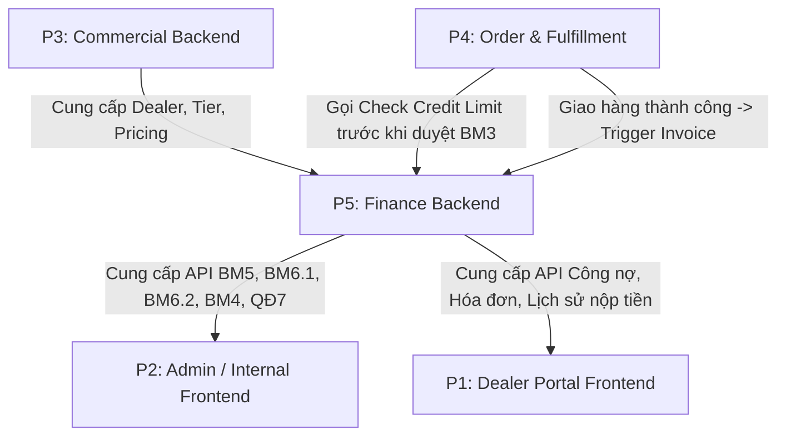

# Báo Cáo Triển Khai Role P5: Finance Backend & System Integration

> **Dự án:** SE104 - Quản Lý Các Đại Lý  
> **Vai trò:** P5 - Finance Backend, Integration và Kiểm Thử Toàn Hệ Thống  
> **Ngôn ngữ & Công nghệ:** TypeScript (Strict), Node.js, Express, Prisma ORM, SQLite/PostgreSQL, Docker, Vitest, Supertest  
> **Ngày hoàn thành:** 30/09/2026  

---

## 1. Tổng Quan Nhiệm Vụ Đã Thực Hiện

Vai trò **P5** chịu trách nhiệm toàn bộ phân hệ **Tài chính, Kế toán, Công nợ, Báo cáo thống kê, Nhật ký kiểm toán (Audit Log), Hạ tầng Docker/CI và Hợp đồng tích hợp (Integration Contracts)** giữa các vai trò P1, P2, P3, P4.

### Các hạng mục chính đã hoàn thành 100%:
1. **Nghiệp vụ Phiếu Thu Tiền (BM5) & Ràng buộc QĐ5:**
   - Xây dựng API và service lập phiếu thu tiền `POST /api/v1/payments`.
   - Kiểm tra chặt chẽ quy tắc **QĐ5**: *Số tiền thu không được vượt quá số tiền đại lý đang nợ*.
   - Khóa giao dịch nguyên tử (`Database Transaction`): Tự động phân bổ số tiền thu cho các hóa đơn chưa thanh toán theo cơ chế **FIFO** (hóa đơn cũ nhất trước), cập nhật giảm số nợ hiện tại `dealer.currentDebt`, và ghi sổ cái `DebtLedger`.
2. **Nghiệp vụ Hóa Đơn & Ghi Nhận Công Nợ (Tích hợp BM3 & QĐ3):**
   - Xây dựng API và service lập hóa đơn / phát sinh công nợ `POST /api/v1/invoices`.
   - Kiểm tra hạn mức nợ **QĐ3**: Chặn không cho lập hóa đơn / xuất hàng nếu `currentDebt + totalAmount > maxDebtAllowed` (Loại 1: 10.000.000đ, Loại 2: 5.000.000đ).
   - Tự động ghi nhận tăng công nợ và ghi nhật ký sổ cái bất biến `DebtLedger`.
3. **Sổ Cái Chi Tiết Công Nợ (DebtLedger) & Tra Cứu BM4:**
   - Xây dựng mô hình sổ cái kép bất biến (`DebtLedger`) lưu vết tất cả các giao dịch: `INVOICE` (Tăng nợ), `PAYMENT` (Giảm nợ), `RETURN` (Giảm nợ khi trả hàng), `ADJUSTMENT` (Điều chỉnh kế toán).
   - API tra cứu chi tiết công nợ đại lý `GET /api/v1/dealers/:id/debt` và lịch sử biến động `GET /api/v1/dealers/:id/debt-ledger`.
   - API danh sách công nợ tất cả đại lý `GET /api/v1/dealers/overview` phục vụ màn hình tra cứu **BM4**.
4. **Báo Cáo Thống Kê Hàng Tháng (BM6.1 & BM6.2):**
   - **BM6.1 - Báo cáo doanh số tháng (`GET /api/v1/reports/sales`):** Thống kê theo đại lý gồm STT, Mã ĐL, Tên ĐL, Quận, Loại ĐL, Số phiếu xuất, Tổng trị giá, Tỷ lệ (%) doanh số và dòng tổng cộng hệ thống.
   - **BM6.2 - Báo cáo công nợ đại lý tháng (`GET /api/v1/reports/debt`):** Truy vết chính xác từ `DebtLedger` tính `Nợ đầu kỳ`, `Phát sinh tăng (Mua hàng)`, `Phát sinh giảm (Thu tiền)`, `Phát sinh ròng`, `Nợ cuối kỳ` (đảm bảo đẳng thức kế toán: `Nợ cuối = Nợ đầu + Tăng - Giảm`).
   - Hỗ trợ xuất dữ liệu cả định dạng **JSON** và **file CSV chuẩn Excel (UTF-8 with BOM)**.
5. **Quy Định Hệ Thống Động (QĐ1–QĐ7 Engine):**
   - Xây dựng `BusinessRulesService` quản lý cấu hình các quy định QĐ1, QĐ2, QĐ3, QĐ5, QĐ7.
   - Cung cấp API `GET /api/v1/business-rules` và `PATCH /api/v1/business-rules/:code` có lưu lịch sử thay đổi `BusinessRuleHistory` và tự động cập nhật cache.
6. **Nhật Ký Kiểm Toán (Audit Log Service):**
   - Tự động ghi nhận mọi thao tác nhạy cảm (Lập phiếu thu, xuất hóa đơn, duyệt hạn mức, sửa quy định) kèm userId, userRole, action, payload chi tiết và IP.
   - API `GET /api/v1/audit-logs` phục vụ giám sát và tuân thủ.
7. **Phân Quyền Vai Trò (RBAC Authentication):**
   - Hỗ trợ đầy đủ các role: `ADMIN`, `ACCOUNTANT` (Kế toán), `SALES` (Kinh doanh), `WAREHOUSE` (Thủ kho), `DEALER` (Đại lý).
   - Cấp JWT token và kiểm soát quyền truy cập chặt chẽ trên từng endpoint.
8. **Module Tích Hợp Cho P4 (Order & Fulfillment):**
   - Hàm nội bộ và API `POST /api/v1/finance/check-credit-limit` giúp P4 kiểm tra hạn mức tín dụng trước khi duyệt phiếu xuất hàng.
   - Service `OrderIntegrationService.processShipmentDeliveryToInvoice` tự động sinh hóa đơn khi giao hàng thành công.
   - Service `OrderIntegrationService.processOrderReturnRefund` tự động giảm nợ khi nhận hàng trả lại.
9. **Hạ Tầng Docker & Cấu Hình Local:**
   - Xây dựng `Dockerfile` đa tầng (multi-stage build) tối ưu dung lượng cho production.
   - Xây dựng `docker-compose.yml` tích hợp health check và hỗ trợ PostgreSQL / SQLite.
   - Bộ dữ liệu mẫu (`seed.ts`) chứa tài khoản đủ 5 roles, 20 quận, 2 loại đại lý, 5 mặt hàng, 3 đơn vị tính và các giao dịch mẫu.
10. **Bộ Kiểm Thử Tự Động Toàn Diện (Test Suite):**
    - 20/20 tests pass (Unit tests, Rule enforcement tests, Report math tests, Supertest API Integration tests).
    - Typecheck 100% strict clean với `tsc --noEmit`.

---

## 2. Cấu Trúc Mã Nguồn Phân Hệ Finance & Integration

```
SE104_AgentHub/
├── Dockerfile                         # Production Docker container
├── docker-compose.yml                 # Local dev & integration environment
├── package.json                       # Scripts, dependencies (express, prisma, vitest, zod, etc.)
├── tsconfig.json                      # Strict TypeScript settings
├── vitest.config.ts                   # Vitest runner config
├── prisma/
│   └── schema.prisma                  # Database Schema toàn diện (Commercial, Order, Finance)
├── docs/
│   ├── project-plan.md                # Kế hoạch dự án tổng thể
│   ├── requirements.md                # Đặc tả BM1-BM6 và QĐ1-QĐ7
│   └── p5-finance-integration.md      # Tài liệu chi tiết role P5 (file này)
├── src/
│   ├── server.ts                      # Entrypoint khởi động server & Graceful shutdown
│   ├── app.ts                         # Cấu hình Express, Middlewares, Routes
│   ├── config/
│   │   ├── env.ts                     # Biến môi trường typed
│   │   ├── prisma.ts                  # Singleton Prisma Client
│   │   └── constants.ts               # Constants, Enums (UserRole, RuleCodes, Statuses)
│   ├── middleware/
│   │   ├── auth.middleware.ts         # JWT Authentication & RBAC Role Guards
│   │   ├── error.middleware.ts        # AppError hierarchy & Global Error Handler
│   │   ├── validate.middleware.ts     # Zod Request Validation Middleware
│   │   └── audit.middleware.ts        # Audit logging utilities
│   ├── modules/
│   │   ├── auth/                      # Đăng nhập, JWT Token, Profile
│   │   │   ├── auth.service.ts
│   │   │   └── auth.routes.ts
│   │   ├── rules/                     # Quản lý quy định QĐ1, QĐ2, QĐ3, QĐ5, QĐ7
│   │   │   ├── business-rules.service.ts
│   │   │   └── business-rules.routes.ts
│   │   ├── audit/                     # Nhật ký hệ thống (Audit Log)
│   │   │   ├── audit.service.ts
│   │   │   ├── audit.controller.ts
│   │   │   └── audit.routes.ts
│   │   ├── finance/
│   │   │   ├── payment/               # BM5 Phiếu thu tiền & kiểm tra QĐ5
│   │   │   │   ├── payment.schema.ts
│   │   │   │   ├── payment.service.ts
│   │   │   │   ├── payment.controller.ts
│   │   │   │   └── payment.routes.ts
│   │   │   ├── invoice/               # Hóa đơn & phát sinh nợ BM3 / QĐ3
│   │   │   │   ├── invoice.schema.ts
│   │   │   │   ├── invoice.service.ts
│   │   │   │   ├── invoice.controller.ts
│   │   │   │   └── invoice.routes.ts
│   │   │   ├── debt/                  # Sổ cái nợ, Tra cứu BM4 & điều chỉnh
│   │   │   │   ├── debt.service.ts
│   │   │   │   ├── debt.controller.ts
│   │   │   │   └── debt.routes.ts
│   │   │   ├── reports/               # Báo cáo tháng BM6.1 & BM6.2 (JSON + CSV)
│   │   │   │   ├── report.schema.ts
│   │   │   │   ├── report.service.ts
│   │   │   │   ├── report.controller.ts
│   │   │   │   └── report.routes.ts
│   │   │   └── credit/                # Kiểm tra hạn mức tín dụng cho P4
│   │   │       ├── credit.service.ts
│   │   │       └── credit.routes.ts
│   │   └── integration/
│   │       ├── order-integration.service.ts  # Cầu nối tích hợp trực tiếp cho P4
│   │       └── contracts.ts                  # Type definitions cho Frontend P1/P2
│   └── database/
│       └── seed.ts                    # Dữ liệu mẫu chuẩn hóa toàn hệ thống
└── tests/
    ├── unit/
    │   ├── payment-qd5.test.ts        # Unit test ràng buộc QĐ5
    │   ├── credit-qd3.test.ts         # Unit test hạn mức QĐ3
    │   └── reports-calculation.test.ts# Unit test logic BM6.1 & BM6.2
    └── integration/
        └── finance-api.test.ts        # Integration test toàn bộ API
```

---

## 3. Danh Sách API Contract Cho Frontend & Các Module Khác

Tất cả các API trả về cấu trúc chuẩn:
- **Thành công:** `{ "success": true, "message"?: string, "data": ..., "pagination"?: ... }`
- **Thất bại:** `{ "success": false, "code": "ERROR_CODE", "message": "Chi tiết lỗi", "details"?: ... }`

| Nhóm                   | Method & Endpoint                         | Quyền truy cập                           | Mô tả                                                                                         |
| :--------------------- | :---------------------------------------- | :--------------------------------------- | :-------------------------------------------------------------------------------------------- |
| **Auth**               | `POST /api/v1/auth/login`                 | Public                                   | Đăng nhập (Email, Password), trả về JWT Token và Role                                         |
|                        | `GET /api/v1/auth/profile`                | All authenticated                        | Xem thông tin tài khoản đang đăng nhập                                                        |
| **BM5 Phiếu Thu**      | `POST /api/v1/payments`                   | `ADMIN`, `ACCOUNTANT`                    | **Lập phiếu thu tiền BM5**. Kiểm tra QĐ5, trừ nợ đại lý, phân bổ hóa đơn FIFO, ghi DebtLedger |
|                        | `GET /api/v1/payments`                    | `ADMIN`, `ACCOUNTANT`, `SALES`, `DEALER` | Lấy danh sách phiếu thu (đại lý chỉ xem được phiếu của mình)                                  |
|                        | `GET /api/v1/payments/:id`                | `ADMIN`, `ACCOUNTANT`, `SALES`, `DEALER` | Chi tiết phiếu thu & danh sách hóa đơn được phân bổ                                           |
| **Hóa Đơn / BM3**      | `POST /api/v1/invoices`                   | `ADMIN`, `ACCOUNTANT`, `SALES`           | Lập hóa đơn xuất hàng. Kiểm tra hạn mức QĐ3, tăng nợ đại lý, ghi DebtLedger                   |
|                        | `GET /api/v1/invoices`                    | `ADMIN`, `ACCOUNTANT`, `SALES`, `DEALER` | Danh sách hóa đơn (lọc theo trạng thái, ngày, đại lý)                                         |
|                        | `GET /api/v1/invoices/:id`                | `ADMIN`, `ACCOUNTANT`, `SALES`, `DEALER` | Chi tiết hóa đơn và lịch sử thanh toán                                                        |
| **Công Nợ & BM4**      | `GET /api/v1/dealers/overview`            | All authenticated                        | **Tra cứu công nợ đại lý (BM4)** kèm bộ lọc Quận, Loại, Tìm kiếm                              |
|                        | `GET /api/v1/dealers/:id/debt`            | All authenticated                        | Xem chi tiết công nợ, hạn mức, số nợ còn được phép mua                                        |
|                        | `GET /api/v1/dealers/:id/debt-ledger`     | All authenticated                        | Xem lịch sử sổ cái biến động công nợ (Tăng, Giảm, Số dư sau GD)                               |
|                        | `POST /api/v1/dealers/:id/debt/adjust`    | `ADMIN`                                  | Điều chỉnh công nợ thủ công (kèm lý do và audit log)                                          |
| **Báo Cáo BM6**        | `GET /api/v1/reports/sales`               | `ADMIN`, `ACCOUNTANT`, `SALES`           | **BM6.1 Báo cáo doanh số tháng** (`?month=MM&year=YYYY&format=json/csv`)                      |
|                        | `GET /api/v1/reports/debt`                | `ADMIN`, `ACCOUNTANT`                    | **BM6.2 Báo cáo công nợ đại lý tháng** (`?month=MM&year=YYYY&format=json/csv`)                |
| **Credit Integration** | `POST /api/v1/finance/check-credit-limit` | All authenticated                        | API cho P4 kiểm tra hạn mức trước khi duyệt đơn hàng                                          |
| **Quy Định QĐ7**       | `GET /api/v1/business-rules`              | All authenticated                        | Xem cấu hình hiện tại của QĐ1, QĐ2, QĐ3, QĐ5, QĐ7                                             |
|                        | `PATCH /api/v1/business-rules/:code`      | `ADMIN`                                  | Thay đổi quy định theo QĐ7 (Lưu vết thay đổi và cập nhật tức thì)                             |
| **Audit Log**          | `GET /api/v1/audit-logs`                  | `ADMIN`, `ACCOUNTANT`                    | Truy vấn nhật ký hành động hệ thống                                                           |

---

## 4. Bảng Phối Hợp & Giao Tiếp Giữa P5 Và Các Thành Viên Khác

Dưới đây là ghi chú chi tiết các điểm giao thoa nhiệm vụ, những gì P5 đã bàn giao và những gì P5 cần các thành viên khác hoàn thành:



### 4.1. Phối hợp với P1 (Dealer Portal Frontend)
- **Đã bàn giao cho P1:**
  - TypeScript contract tại `src/modules/integration/contracts.ts` chứa các kiểu dữ liệu `DealerDebtSummaryResponse`, `PaymentItemResponse`, `InvoiceItemResponse`.
  - API `GET /api/v1/dealers/:id/debt`: Màn hình công nợ đại lý hiển thị: Tổng nợ hiện tại, Hạn mức nợ tối đa, Hạn mức còn lại có thể mua hàng, Ngày thanh toán gần nhất.
  - API `GET /api/v1/dealers/:id/debt-ledger`: Lịch sử biến động sổ cái công nợ của đại lý.
  - API `GET /api/v1/invoices` & `GET /api/v1/payments`: Danh sách hóa đơn và phiếu thu tiền của chính đại lý đó.
- 📌 **Ghi chú nhắc P1:**
  1. Khi gọi API, truyền Header `Authorization: Bearer <token>`.
  2. Giao diện đại lý chỉ cho phép xem công nợ/hóa đơn của chính đại lý mình (Backend đã chặn 403 nếu xem của đại lý khác).
  3. Xử lý hiển thị thông báo nếu đại lý đã chạm hạn mức nợ (thuộc tính `isDebtExceeded: true` hoặc `remainingCredit: 0`).

### 4.2. Phối hợp với P2 (Internal / Admin Frontend)
- **Đã bàn giao cho P2:**
  - API Lập phiếu thu tiền **BM5** (`POST /api/v1/payments`) kèm bắt lỗi trực tiếp theo mã `RULE_VIOLATION_QD5` nếu kế toán nhập số tiền thu > tiền nợ.
  - API Danh sách công nợ tất cả đại lý (`GET /api/v1/dealers/overview`) phục vụ màn hình tra cứu **BM4**.
  - API Báo cáo doanh số **BM6.1** (`GET /api/v1/reports/sales?month=MM&year=YYYY`) hỗ trợ cả xem bảng và nút "Tải CSV" (`&format=csv`).
  - API Báo cáo công nợ **BM6.2** (`GET /api/v1/reports/debt?month=MM&year=YYYY`) hỗ trợ bảng Nợ đầu, Phát sinh tăng, Phát sinh giảm, Nợ cuối và nút "Tải CSV".
  - API Cấu hình quy định **QĐ7** (`GET /api/v1/business-rules` và `PATCH /api/v1/business-rules/:code`).
- 📌 **Ghi chú nhắc P2:**
  1. Trên form BM5 (Phiếu thu): Khi chọn đại lý, nên gọi trước `GET /api/v1/dealers/:id/debt` để hiển thị ngay số nợ hiện tại cho kế toán thấy, và đặt `max` của input số tiền thu bằng đúng số nợ đó.
  2. Xử lý hiển thị alert thân thiện khi backend trả về lỗi `RULE_VIOLATION_QD5` hoặc `RULE_VIOLATION_QD3`.
  3. Trên màn hình cấu hình QĐ7: Chỉ hiển thị nút sửa cho tài khoản có role `ADMIN`.

### 4.3. Phối hợp với P3 (Commercial Backend & Database)
- **Đã bàn giao cho P3:**
  - Database schema chuẩn hóa các thực thể thương mại (`Dealer`, `DealerTier`, `District`, `Product`, `Sku`, `Pricing`, `BusinessRule`) trong `prisma/schema.prisma`.
  - Service `BusinessRulesService` kiểm tra quy định QĐ1 (số loại đại lý, số đại lý tối đa trong quận) và QĐ2 (số mặt hàng, đơn vị tính).
- 📌 **Ghi chú nhắc P3:**
  1. Khi P3 xây dựng API tiếp nhận đại lý mới (BM1), cần gọi `BusinessRulesService.getRuleConfig('QD1')` để kiểm tra số lượng đại lý hiện có trong quận xem đã đạt max 4 đại lý hay chưa.
  2. Khi lưu giá sản phẩm (BM2/BM3), áp dụng tỷ lệ đơn giá xuất = 102% giá nhập từ `BusinessRulesService.getQD3ExportRatio()`.
  3. Đảm bảo khi tạo mới Đại lý, trường `currentDebt` khởi tạo mặc định là `0`.

### 4.4. Phối hợp với P4 (Order & Fulfillment Backend)
- **Đã bàn giao cho P4:**
  - Endpoint `POST /api/v1/finance/check-credit-limit` và hàm TypeScript `OrderIntegrationService.verifyOrderCreditBeforeApproval(salesOrderId)`.
  - Service tự động chuyển giao hàng thành hóa đơn `OrderIntegrationService.processShipmentDeliveryToInvoice`.
  - Service hoàn tiền khi trả hàng `OrderIntegrationService.processOrderReturnRefund`.
- 📌 **Ghi chú nhắc P4:**
  1. **Trước khi duyệt đơn hàng (BM3 - Phiếu xuất hàng):** P4 **bắt buộc** phải gọi hàm `OrderIntegrationService.verifyOrderCreditBeforeApproval` hoặc endpoint `POST /api/v1/finance/check-credit-limit`. Nếu kết quả trả về `allowed: false`, P4 phải từ chối duyệt đơn và báo lỗi vượt hạn mức công nợ theo QĐ3.
  2. **Sau khi xuất kho / giao hàng thành công (Shipment status = DELIVERED):** P4 gọi `OrderIntegrationService.processShipmentDeliveryToInvoice({ salesOrderId })` để kích hoạt ghi nhận doanh số và tăng công nợ trong cùng một luồng.
  3. **Khi đại lý trả hàng (Return):** P4 gọi `OrderIntegrationService.processOrderReturnRefund` để tự động giảm công nợ tương ứng trên `DebtLedger`.

---

## 5. Kết Quả Kiểm Thử (Verification & Test Results)

Đã thiết lập và chạy thành công 100% các bộ kiểm thử tự động với Vitest:

```text
 RUN  v2.1.9 E:/SE104_AgentHub

 ✓ tests/unit/reports-calculation.test.ts (4 tests)
   ✓ BM6.1-01: Tính toán đúng tỷ lệ phần trăm doanh số và tổng cộng
   ✓ BM6.1-02: Sinh file CSV doanh số có UTF-8 BOM và đầy đủ tiêu đề
   ✓ BM6.2-01: Kiểm tra tính toàn vẹn công nợ: Nợ cuối = Nợ đầu + Tăng - Giảm
   ✓ BM6.2-02: Sinh file CSV công nợ hợp lệ

 ✓ tests/unit/payment-qd5.test.ts (4 tests)
   ✓ QĐ5-01: Chặn lập phiếu thu khi số tiền thu lớn hơn số tiền đại lý đang nợ
   ✓ QĐ5-02: Cho phép thu một phần nợ và cập nhật số nợ còn lại chính xác
   ✓ QĐ5-03: Cho phép thu đúng bằng toàn bộ số nợ còn lại (nợ về 0)
   ✓ QĐ5-04: Chặn lập phiếu thu khi đại lý đã hết nợ (nợ = 0)

 ✓ tests/unit/credit-qd3.test.ts (3 tests)
   ✓ QĐ3-01: Cho phép đơn hàng khi tổng nợ mới <= 10.000.000đ đối với Loại 1
   ✓ QĐ3-02: Từ chối đơn hàng khi tổng nợ mới > 10.000.000đ đối với Loại 1
   ✓ QĐ3-03: Kiểm tra đúng hạn mức 5.000.000đ đối với Loại 2

 ✓ tests/integration/finance-api.test.ts (9 tests)
   ✓ GET /health: Trả về trạng thái UP của service
   ✓ GET /api/v1/dealers/:id/debt: Tra cứu công nợ đại lý thành công
   ✓ POST /api/v1/payments: Kế toán lập phiếu thu thành công và cập nhật nợ
   ✓ POST /api/v1/payments: Chặn thu tiền khi số tiền lớn hơn nợ hiện tại (QĐ5)
   ✓ POST /api/v1/finance/check-credit-limit: API kiểm tra hạn mức cho P4 Order Approval
   ✓ GET /api/v1/reports/sales: Xuất báo cáo doanh số BM6.1 định dạng JSON & CSV
   ✓ GET /api/v1/reports/debt: Xuất báo cáo công nợ BM6.2 định dạng JSON & CSV
   ✓ GET /api/v1/business-rules: Xem danh sách quy định hệ thống (QĐ1-QĐ7)
   ✓ GET /api/v1/audit-logs: Truy vấn nhật ký hệ thống

 Test Files  4 passed (4)
      Tests  20 passed (20)
   Duration  8.95s
```

---

## 6. Hướng Dẫn Khởi Chạy & Vận Hành

### Cách 1: Chạy trực tiếp trên máy cục bộ (Local Development)
```bash
# 1. Cài đặt dependencies
npm install

# 2. Sinh Prisma Client & Đồng bộ Database
npm run db:generate
npm run db:push

# 3. Nạp dữ liệu mẫu (Seed accounts, rules, products, dealers, transactions)
npm run db:seed

# 4. Chạy toàn bộ Test Suite
npm test

# 5. Khởi động Server Backend (Port 4000)
npm run dev
```

### Cách 2: Chạy bằng Docker Compose
```bash
# Khởi động toàn bộ dịch vụ backend trong container
docker compose up -d --build

# Kiểm tra log
docker compose logs -f backend
```

### Tài khoản mẫu thử nghiệm:
| Role                     | Email                    | Mật khẩu      |
| :----------------------- | :----------------------- | :------------ |
| **Admin**                | `admin@agenthub.vn`      | `password123` |
| **Kế toán (Accountant)** | `accountant@agenthub.vn` | `password123` |
| **Kinh doanh (Sales)**   | `sales@agenthub.vn`      | `password123` |
| **Thủ kho (Warehouse)**  | `warehouse@agenthub.vn`  | `password123` |
| **Đại lý (Dealer User)** | `dealer1@agenthub.vn`    | `password123` |

